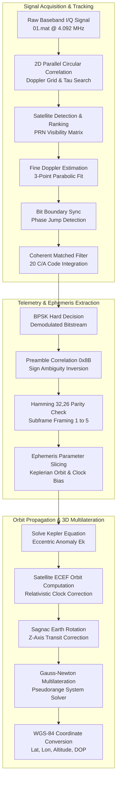
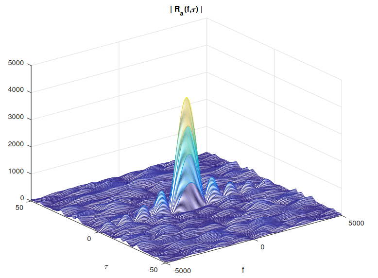
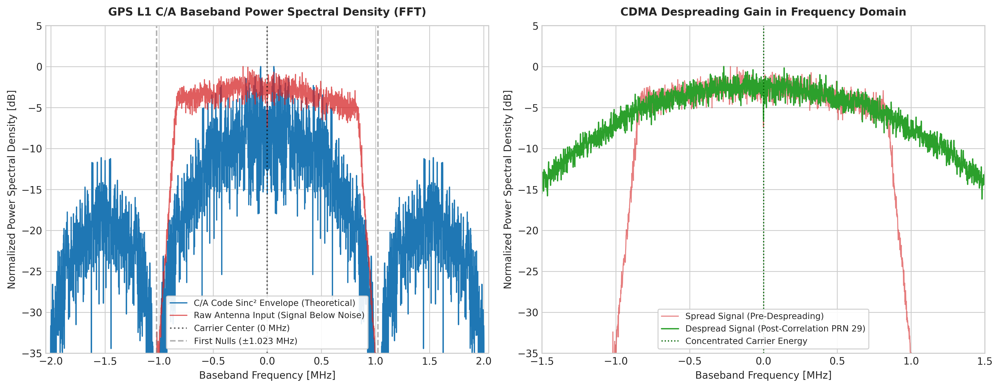
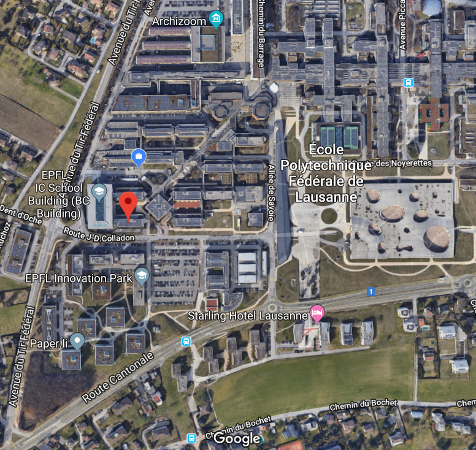

# GPS Software-Defined Radio (SDR) Receiver, Navigation Decoder and WGS-84 Positioning System

[](https://www.python.org/)
[](docs/specifications/IS-GPS-200D.pdf)
[]()
[]()
[](https://go.epfl.ch/COM-430)

An autonomous **GPS L1 C/A Software-Defined Radio (SDR) receiver, navigation message decoder, and 3D positioning engine** implemented in Python. Developed at **École Polytechnique Fédérale de Lausanne (EPFL)** as part of the *COM-430: Modern digital communications: a hands-on approach* curriculum (Instructor: Dr. Nicolae Chiurtu).

The receiver processes raw baseband I/Q antenna samples captured from a USRP SDR front-end at $f_{\mathrm{L1}} = 1575.42\text{ MHz}$ ($f_s = 4.092\text{ MHz}$), executing the complete signal processing chain from satellite acquisition to sub-meter WGS-84 geodetic multilateration.

---

## Table of Contents
1. [System Overview](#system-overview)
2. [System Specifications and Parameters](#system-specifications-and-parameters)
3. [Receiver Architecture and Signal Flow](#receiver-architecture-and-signal-flow)
4. [Digital Signal Processing Pipeline](#digital-signal-processing-pipeline)
   - [2D Code-Phase and Doppler Acquisition](#2d-code-phase-and-doppler-acquisition)
   - [Code and Carrier Tracking Loops](#code-and-carrier-tracking-loops)
   - [Preamble Synchronization and Hamming Parity](#preamble-synchronization-and-hamming-parity)
   - [Ephemeris Extraction and Orbital Mechanics](#ephemeris-extraction-and-orbital-mechanics)
   - [Relativistic and Sagnac Corrections](#relativistic-and-sagnac-corrections)
   - [Gauss-Newton Multilateration and WGS-84 Conversion](#gauss-newton-multilateration-and-wgs-84-conversion)
5. [Experimental Positioning Results](#experimental-positioning-results)
6. [Repository Structure](#repository-structure)
7. [Getting Started](#getting-started)
8. [Documentation and Course Materials](#documentation-and-course-materials)
9. [Academic Context: COM-430](#academic-context-com-430)
10. [Authors and Acknowledgments](#authors-and-acknowledgments)

---

## System Overview

Global Positioning System (GPS) space vehicles broadcast direct-sequence spread spectrum (DSSS) signals in the L-band. At the receiver, signal power is typically below the thermal noise floor (-130 dBm to -160 dBm), requiring high-gain coherent correlation and precise Doppler compensation.

This software receiver implements an end-to-end processing pipeline:
- **Satellite Acquisition:** Fast Fourier Transform (FFT) circular cross-correlation across all 32 PRN Gold codes over a 2D grid (±10 kHz Doppler, 4092-sample code phase).
- **Signal Tracking:** Parabolic Doppler refinement, bit transition edge detection, and coherent 20-period matched filter accumulation.
- **Telemetry Processing:** Frame synchronization using the 8-bit preamble (`0x8B`), BPSK sign ambiguity inversion, and extended Hamming (32, 26) parity checking with word-to-word carry bits ($D_{29}^\ast, D_{30}^\ast$).
- **Orbital Mechanics:** Ephemeris parameter extraction, iterative solution of Kepler's equation for eccentric anomaly $E_k$, satellite clock polynomial evaluation, and relativistic drift correction.
- **Geodetic Positioning:** Earth rotation compensation (Sagnac effect), multi-satellite non-linear Gauss-Newton multilateration, and conversion to WGS-84 coordinates (Latitude, Longitude, Altitude).

---

## System Specifications and Parameters

| Parameter | Symbol / Variable | Value | Description |
| :--- | :--- | :--- | :--- |
| Carrier Frequency | $f_{\mathrm{L1}}$ | 1575.42 MHz | GPS L1 carrier frequency (154 × 10.23 MHz) |
| Sampling Rate | $f_s$ | 4.092 MHz | Receiver ADC baseband sampling frequency |
| Sampling Period | $T_s$ | 244.38 ns | $T_s = 1 / f_s$ |
| Chip Rate | $f_{\mathrm{chip}}$ | 1.023 Mchips/s | C/A Gold code chipping rate |
| Samples per Chip | $N_{\mathrm{spch}}$ | 4 samples | Oversampling ratio ($f_s / f_{\mathrm{chip}}$) |
| C/A Code Length | $N_{\mathrm{code}}$ | 1023 chips | Period of one Gold code repetition (1.0 ms) |
| Samples per C/A Period | $N_{\mathrm{spc}}$ | 4092 samples | Samples per 1 ms code epoch |
| Codes per Navigation Bit | $N_{\mathrm{cpb}}$ | 20 codes | DSSS spreading factor per bit (20 ms) |
| Navigation Bit Rate | $R_{\mathrm{bit}}$ | 50 bps | GPS broadcast navigation message rate |
| Subframe Duration | $T_{\mathrm{subframe}}$ | 6.0 s | 300 bits per telemetry subframe |
| Page / Frame Duration | $T_{\mathrm{frame}}$ | 30.0 s | 5 subframes = 1500 bits |
| Speed of Light | $c$ | 299,792,458 m/s | Vacuum propagation speed |
| Earth Gravitational Parameter | $\mu_e$ | 3.986005 × 10¹⁴ m³/s² | WGS-84 geocentric gravitational constant |
| Earth Angular Velocity | $\dot{\Omega}_e$ | 7.2921151467 × 10⁻⁵ rad/s | WGS-84 Earth rotation rate |

---

## Receiver Architecture and Signal Flow



---

## Digital Signal Processing Pipeline

### 2D Code-Phase and Doppler Acquisition

Satellite visibility is established via two-dimensional cross-correlation between the incoming baseband stream $y[n]$ and the PRN Gold code sequence $p[n]$:

$$
R(\tau, f_d) = \left| \sum_{n=0}^{N-1} y[n] \, e^{-j 2\pi f_d n T_s} \, p^\ast[n - \tau] \right|
$$

The receiver evaluates a Doppler search space of [-10 kHz, +10 kHz] with a coarse grid of 500 Hz across all 32 satellites. The Doppler estimate is then refined using a 3-point parabolic polynomial fit over a 10-epoch coherent window.

<p align="center">
  
  <br/>
  <em>Figure: GPS C/A Gold code correlation profile and code-phase delay synchronization peak.</em>
</p>

---

### Code and Carrier Tracking Loops

Navigation data bits span 20 consecutive C/A code periods (20 ms). To achieve synchronization:
1. **Bit Transition Edge Detection:** Computes consecutive C/A correlation inner products and detects phase transitions of $\pi$ radians ($|\Delta \phi| \gt 3\pi / 4$).
2. **Delay Tracking (DLL):** Dynamically adjusts the sampling offset $\tau$ within $\pm 2$ samples of the peak correlation.
3. **Doppler Tracking (FLL/PLL):** Continuously tracks oscillator drift by fitting a second-degree polynomial to candidate Doppler shifts ($f_d \pm 20\text{ Hz}$) and updating the carrier frequency.

<p align="center">
  
  <br/>
  <em>Figure: GPS L1 C/A baseband Power Spectral Density (FFT) showing theoretical vs raw antenna spectrum (left) and CDMA despreading energy concentration in the frequency domain (right).</em>
</p>

---

### Preamble Synchronization and Hamming Parity

Each 300-bit subframe begins with an 8-bit Telemetry (TLM) preamble pattern:

$$
\mathbf{P}_{\mathrm{preamble}} = [1, 0, 0, 0, 1, 0, 1, 1] \quad \text{(0x8B)}
$$

- **Sign Ambiguity Resolution:** If the correlation peak is negative, all bits in the stream are inverted.
- **Extended Hamming Parity:** Each 30-bit word contains 24 data bits ($d_1, \dots, d_{24}$) and 6 parity bits ($D_{25}, \dots, D_{30}$) computed via parity matrix $\mathbf{H}_{26 \times 6}$ conditioned on the preceding word's last two bits ($D_{29}^\ast, D_{30}^\ast$).

---

### Ephemeris Extraction and Orbital Mechanics

Ephemeris parameters decoded from subframes 1, 2, and 3 define the satellite's osculating Keplerian orbit per IS-GPS-200D:

1. **Mean Motion and Anomaly:** Computes the computed mean motion $n_0 = \sqrt{\mu_e / a^3}$, applies the delta correction $n = n_0 + \Delta n$, and evaluates the mean anomaly at time $t$:

$$
M_k = M_0 + n (t - t_{oe})
$$

2. **Kepler's Equation for Eccentric Anomaly ($E_k$):** Solves the transcendental Kepler equation via iterative fixed-point iteration until convergence ($|E_k^{(m+1)} - E_k^{(m)}| \lt 10^{-14}$):

$$
M_k = E_k - e \sin E_k
$$

3. **True Anomaly ($\nu_k$) and Argument of Latitude ($\Phi_k$):** Evaluates true anomaly from eccentric anomaly and calculates the orbital argument of latitude:

$$
\Phi_k = \nu_k + \omega
$$

4. **Harmonic Perturbation Corrections:** Evaluates 2nd harmonic cosine and sine corrections for argument of latitude ($\delta u_k$), orbit radius ($\delta r_k$), and inclination angle ($\delta i_k$).

---

### Relativistic and Sagnac Corrections

- **Relativistic Clock Drift:** Corrects for gravitational time dilation caused by orbital eccentricity:

$$
\Delta t_{\mathrm{rel}} = F \cdot e \cdot \sqrt{a} \sin E_k, \quad F = -\frac{2\sqrt{\mu_e}}{c^2}
$$

- **Satellite Clock Bias:** Evaluates the 2nd-order polynomial clock model including group delay differential $T_{\mathrm{GD}}$:

$$
\Delta t_{\mathrm{sv}} = a_{f0} + a_{f1}(t - t_{oc}) + a_{f2}(t - t_{oc})^2 + \Delta t_{\mathrm{rel}} - T_{\mathrm{GD}}
$$

- **Sagnac Earth Rotation Compensation:** Corrects satellite ECEF coordinates for Earth rotation during signal transit time $\Delta t_{\mathrm{transit}} = \rho_c / c$:

$$
\mathbf{x}_{\mathrm{sat}}(t_{\mathrm{tr}}) = \mathbf{R}_z\left(\dot{\Omega}_e \frac{\rho_c}{c}\right) \mathbf{x}_{\mathrm{sat}}(t_{\mathrm{tx}})
$$

---

### Gauss-Newton Multilateration and WGS-84 Conversion

The receiver determines its Cartesian position $\mathbf{x}_r = [x_r, y_r, z_r]^T$ and clock bias $b = c \Delta t_r$ by minimizing the non-linear pseudorange residual system:

$$
f_i(\mathbf{x}_r, b) = \|\mathbf{x}_{\mathrm{sat}, i} - \mathbf{x}_r\| - (\rho_{c, i} + b) = 0, \quad i = 1, \dots, K
$$

The system is linearized and solved iteratively via Moore-Penrose pseudo-inverse:

$$
\begin{bmatrix} \mathbf{x}_r^{(n+1)} \\\\ b^{(n+1)} \end{bmatrix} = \begin{bmatrix} \mathbf{x}_r^{(n)} \\\\ b^{(n)} \end{bmatrix} - \mathbf{J}^{\dagger} \mathbf{f}(\mathbf{x}_r^{(n)}, b^{(n)})
$$

The resulting Cartesian coordinates $(x_r, y_r, z_r)$ are converted to geodetic coordinates on the **WGS-84 reference ellipsoid** (semi-major axis $a = 6378137.0\text{ m}$, flattening $f = 1/298.257223563$).

---

## Experimental Positioning Results

The receiver was evaluated against real RF baseband samples recorded at the **EPFL Campus in Lausanne, Switzerland**:

<p align="center">
  
  <br/>
  <em>Figure: Calculated receiver position centered on the EPFL campus (Lausanne, Switzerland) on Google Maps.</em>
</p>

```text
======================================================================
  NAVIGATION & POSITIONING SOLUTION
======================================================================
  Geodetic System:   WGS-84 (World Geodetic System 1984)
  Latitude:             46.518635° N
  Longitude:             6.562467° E
  Ellipsoid Height:        439.80 m
----------------------------------------------------------------------
  Dilution of Precision (DOP):
    GDOP (Geometric):  7.60
    PDOP (Position):   6.31
    HDOP (Horizontal): 4.73
    VDOP (Vertical):   4.17
----------------------------------------------------------------------
  Google Maps Link:  https://www.google.com/maps?q=46.518635,6.562467
  Execution Time:    3.16 ms
======================================================================
```

### Detected Satellite Constellation

| Satellite PRN | Coarse Doppler ($f_d$) | Fine Doppler ($f_d$) | Code Phase ($\tau$) | Status |
| :--- | :--- | :--- | :--- | :--- |
| **PRN 29** | -2800 Hz | -2730.00 Hz | 890 samples | Acquired & Decoded (Parity OK) |
| **PRN 04** | +800 Hz | +810.00 Hz | 4001 samples | Acquired & Decoded (Parity OK) |
| **PRN 26** | +1700 Hz | +1730.00 Hz | 280 samples | Acquired & Decoded (Parity OK) |
| **PRN 21** | +1300 Hz | +1190.00 Hz | 3346 samples | Acquired & Decoded (Parity OK) |
| **PRN 25** | -3600 Hz | -3600.00 Hz | 3536 samples | Acquired & Decoded (Parity OK) |
| **PRN 31** | -1800 Hz | -1800.00 Hz | 3082 samples | Acquired & Decoded (Parity OK) |

---

## Repository Structure

```text
.
├── README.md                      # Technical documentation and system architecture
├── main_full_pipeline.py          # End-to-end master runner (Acquisition -> PVT)
├── main_pvt_positioning.py        # 3D WGS-84 multilateration positioning solver
├── main_ephemeris_decoding.py     # Navigation frame, parity, and orbit extraction
├── main_acquisition.py            # 2D Doppler and Gold code acquisition engine
│
├── src/                           # Modular GPS SDR Core Package
│   ├── __init__.py                # Package API initialization
│   ├── config.py                  # Physical constants, signal rates, and paths
│   ├── ca_code.py                 # 1023-chip Gold C/A code LFSR generator
│   ├── signal_io.py               # Memory-efficient I/Q sample streaming buffer
│   ├── acquisition.py             # 2D cross-correlation and Doppler estimation
│   ├── tracking.py                # Bit edge detection, DLL, and FLL/PLL loops
│   ├── navigation.py              # Preamble sync (0x8B) and Hamming (32,26) parity
│   ├── ephemeris.py               # IS-GPS-200D ephemeris parameter parser
│   └── pvt_solver.py              # Orbit propagation, Sagnac, and Gauss-Newton solver
│
├── data/                          # RF captures and intermediate data
│   ├── 01.mat                     # Raw baseband I/Q signal capture (L1 @ 4.092 MHz)
│   ├── CAcodes.mat                # Pre-computed C/A code matrix
│   ├── foundSat.mat               # Acquisition parameters for visible satellites
│   ├── bits*-long.mat             # Demodulated navigation bitstreams
│   ├── ephemerisAndPseudorange*.mat # Extracted ephemerides and pseudoranges
│   └── correct_sats.mat           # Validated satellite subset for positioning
│
└── docs/                          # Academic documentation & reference materials
    ├── figures/                   # High-resolution positioning, correlation, and spectrum plots
    │   ├── epfl_wgs84_positioning_result.png
    │   ├── gps_autocorrelation_plot.png
    │   └── gps_fft_spectral_analysis.png
    ├── notes/                     # Handwritten lecture notes
    │   ├── 3EphemeridesAndPseudoranges-part1-2024.pdf
    │   └── 3EphemeridesAndPseudoranges-part2-2024.pdf
    ├── assignments/               # Course assignment handouts
    │   ├── gpsSynchronization_assignment.pdf
    │   ├── gpsDecoding_assignment.pdf
    │   ├── gpsEphemerides_assignment.pdf
    │   └── gpsPosition_assignment.pdf
    ├── slides/                    # Technical lecture slides
    │   ├── 1Decoding.pdf
    │   ├── 2BigPicture.pdf
    │   ├── 3EphemeridesAndPseudoranges.pdf
    │   ├── 4OrbitsAndReferenceSystems.pdf
    │   └── 5Positioning.pdf
    ├── specifications/            # Official technical standard
    │   └── IS-GPS-200D.pdf
    └── exams/                     # Midterm exams and solutions
        ├── Midterm_2021/
        ├── Midterm_2024/
        └── Midterm_2025/
```

---

## Getting Started

### Prerequisites
- Python 3.10 or higher.
- NumPy, SciPy, Matplotlib, h5py.

```bash
pip install numpy scipy matplotlib h5py
```

### Execution

#### 1. End-to-End Master Pipeline
Executes satellite tracking, telemetry extraction, and 3D positioning:
```bash
python3 main_full_pipeline.py
```

#### 2. WGS-84 Multilateration Solver
Computes receiver coordinates, altitude, DOP metrics, and Google Maps link:
```bash
python3 main_pvt_positioning.py
```

#### 3. Navigation Message and Ephemeris Decoder
Decodes subframes, validates Hamming parity, and extracts orbital parameters:
```bash
python3 main_ephemeris_decoding.py
```

#### 4. Satellite Signal Acquisition
Scans all 32 PRN Gold codes on raw RF antenna capture (`data/01.mat`):
```bash
python3 main_acquisition.py
```

---

## Documentation and Course Materials

All theoretical foundations, derivations, and specifications are organized in `docs/`:
- **Personal Lecture Notes:** [docs/notes/](docs/notes/)
- **Course Assignments:** [docs/assignments/](docs/assignments/)
- **Technical Slides:** [docs/slides/](docs/slides/)
- **Official Standard:** [IS-GPS-200D (PDF)](docs/specifications/IS-GPS-200D.pdf)
- **Exam Problems & Solutions:** [docs/exams/](docs/exams/)

---

## Academic Context: COM-430

This project was developed within the official curriculum of the master's course **COM-430: Modern digital communications: a hands-on approach** at **École Polytechnique Fédérale de Lausanne (EPFL)**, taught by **Dr. Nicolae Chiurtu**.

### Course Specifications (EPFL Course Booklet)

| Attribute | Specification |
| :--- | :--- |
| **Course Code** | **COM-430** |
| **Course Title** | *Modern digital communications: a hands-on approach* |
| **Instructor** | Dr. Nicolae Chiurtu |
| **Institution** | École Polytechnique Fédérale de Lausanne (EPFL) |
| **Language of Teaching** | English |
| **Credits** | 8 ECTS |
| **Semester / Session** | Fall / Winter |
| **Workload** | 240 hours total (14 weeks: 4 hours weekly — 2h Lecture, 2h Lab) |
| **Exam** | During the semester (Written and practical midterm & final exam) |
| **Grading Scheme** | 40% Midterm exam, 60% Final exam |
| **Teaching Methods** | *Ex cathedra* lectures and small projects |
| **Expected Activities** | Follow lectures; guided as well as independent work on projects |
| **Resources** | Lecture notes / Handbook |
| **Moodle Portal** | [https://go.epfl.ch/COM-430](https://go.epfl.ch/COM-430) |
| **Remark** | *This course will be last given in fall 2025.* |

### Target Cursus & Study Programs

| Study Program | Semester | Type |
| :--- | :--- | :--- |
| **Communication Systems Minor** | H | Optional (Opt.) |
| **Computer Science** | MA1, MA3 | Mandatory (Obl.) |
| **Cybersecurity** | MA1, MA3 | Optional (Opt.) |
| **SC Master EPFL** | MA1, MA3 | Mandatory (Obl.) |

### Summary
This course complements the theoretical knowledge learned in Principles of Digital Communications (PDC) with more advanced topics such as OFDM, MIMO, fading channels, and GPS positioning. This knowledge is put into practice with hands-on exercises based on MATLAB or Python (at choice) and on a software-defined radio platform.

### Syllabus & Course Content
1. **Software Radio:** Key concepts.
2. **Signal Processing Chain:** MATLAB/Python implementation of the signal processing chain to the level of detail taught in *Principles of Digital Communications* (PDC: COM-302).
3. **Channel Modeling:** Estimation and equalization.
4. **Wireless SDR Testbed:** Implementation of a basic wireless communication system using a software-defined radio testbed.
5. **Fading and Diversity:** Multipath propagation, Rayleigh fading, and diversity techniques.
6. **OFDM and MIMO:** Theory and implementation.
7. **CDMA in GPS:** CDMA in the context of a GPS system.
8. **GPS Signal Decoding & Positioning:** Decoding of a GPS signal and positioning.

- **Keywords:** Wireless, OFDM, Diversity, Coding, GPS, CDMA, MMSE, Rayleigh fading, software-defined radio, channel estimation.

### Learning Prerequisites
- **Required Courses:** COM-302 Principles of Digital Communications (PDC) or equivalent.
- **Important Concepts:** Solid understanding of linear algebra and probability as well as real and complex analysis.

### Learning Outcomes
By the end of the course, the student must be able to:
- Design and implement an advanced digital communication system (data rate, spectral bandwidth, energy requirements, error probability, implementation complexity).
- Model physical properties of wired and wireless communication channels.
- Implement various parts of a "physical-layer" digital communication system.
- Understand what software-defined radio is all about.

### Teaching & Assessment Methods
- **Teaching Methods:** *Ex cathedra* lectures and small projects.
- **Expected Student Activities:** Follow lectures; guided as well as independent work on projects.
- **Assessment Methods:** Written and practical midterm and final exam during the semester (40% midterm exam, 60% final exam).
- **Resources:** Notes/Handbook: Lecture notes. Moodle link: [https://go.epfl.ch/COM-430](https://go.epfl.ch/COM-430).

---

## Authors and Acknowledgments

- **Daniel Pereira Riquelme** — *Implementation, DSP Algorithms & System Architecture*

**Course:** *COM-430: Modern digital communications: a hands-on approach*  
**Instructor:** Dr. Nicolae Chiurtu  
**Institution:** School of Computer and Communication Sciences (IC), **École Polytechnique Fédérale de Lausanne (EPFL)**  
**Moodle:** [https://go.epfl.ch/COM-430](https://go.epfl.ch/COM-430)
